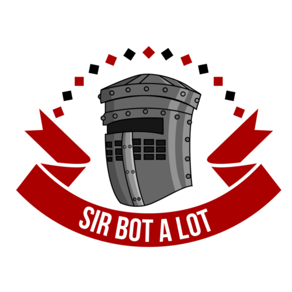

======
|icon|
======

|build| |doc|

An asynchronous python bot framework.

The uses of bots are nearly endless and come in all shapes and sizes.
They can handle Slack shenanigans, monitor the status of a crypto-currency,
or become your personal assistant. Sir-bot-a-lot can help you get started
writing your own.

Sir-bot-a-lot is a project maintained by the `pyslackers`_ community.
Want to join? `Get an invite`_ !

.. _pyslackers: http://pyslackers.com
.. _Get an invite: http://pyslackers.com
.. |build| image:: https://travis-ci.org/pyslackers/sir-bot-a-lot.svg?branch=master
    :alt: Build status
    :target: https://travis-ci.org/pyslackers/sir-bot-a-lot
.. |doc| image:: https://readthedocs.org/projects/sir-bot-a-lot/badge/?version=latest
    :alt: Documentation status
    :target: http://sir-bot-a-lot.readthedocs.io/en/latest

Documentation available `here`_.

.. _here: http://sir-bot-a-lot.readthedocs.io/en/latest/